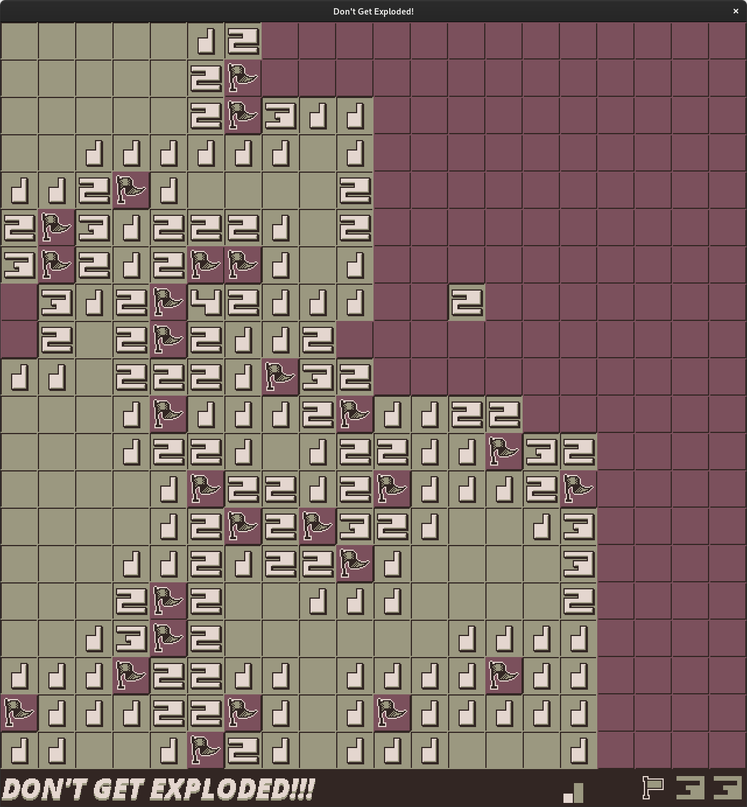

# Don't Get Exploded!

## Description

Flag those mines and don't get exploded! **Don't Get Exploded** is a single player logic puzzle game involving mines, deductive reasoning, and flags. You know this game. It goes by many names, usually with the word "mine" in the forefront. If for some incredible reason, you are not familiar with this type of game, here's the basic game play rules:

Start the game by selecting a random tile. If the underlying feature is an empty cell, it will expose more tiles until it reaches proximity count tiles. Use the information provided by these proximity count tiles to deduce where the hidden mines are located. Place a flag on the unexposed tile where you believe a mine is resting underneath.

If you expose a tile that has a mine underneath, the game is over. The goal is to correctly flag all assumed mine locations. A counter in the lower right corner indicates how many flags are available to place (based on the difficulty setting). If there are no more available flags to place, and the game hasn't ended in your favor, then some placed flags are incorrect. You may remove placed flags at any time.

<<<<<<< HEAD

=======
;
>>>>>>> 41dc873 (General refactoring.)

## Input

The mouse is used as primary input. Click the **LEFT BUTTON** to expose what lies beneath a top level tile. Click the **RIGHT BUTTON** to place a flag on the unexposed top level tile. To remove a flag that has been place, click the **RIGHT BUTTON** on the flag.

The game is set to medium difficulty by default. You can reset the game to an alternate difficulty setting by using the **F1**, **F2**, and **F3** keys on the keyboard.

``F1``- New game at **EASY PEASY** difficulty setting. Flag 30 mines.

``F2``- New game at **I LIKE IT SPICY!** difficulty setting. Flag 60 mines.

``F3``- New game at **WHY SO SERIOUS?** difficulty setting. Flag 90 mines.

``F9``- New game (**RESET**) at the currently selected difficulty setting.

The game features sixteen (4-color) palettes. To cycle through the palettes, use the following keys:

``, (comma)`` - Switch to previous palette in the palette list. This will loop to the last palette if you are on palette zero.

``. (period)`` - Switch to next palette in the palette list. This will loop to the first palette if you are on the last palette.

To exit the game completely, close the game window.

 

## Customization

The tile sheet is just a PNG image with art featuring only four shades of gray. If you change the art in the tile sheet, be sure to only use the following colors:

``COLOR 0: R 32, G 32, B 32; HEX 202020``

``COLOR 1: R 96, G 96, B 96; HEX 606060``

``COLOR 2: R 160, G 160, B 169; HEX a0a0a0``

``COLOR 3: R 224, G 224, B 224; HEX e0e0e0``

Color 0 is considered the darkest shade and color 3, the brightest. At runtime, the program looads this image and converts this palette to an indexed surface, which is used for palette swaps. Palettes can be added, removed, and modified in the ``palettes.hex`` file. When the program reads this file, it ignores blank lines and comment lines beginning with a `#`.

Each palette must have its color entries, starting with color 0, at the start of a new line. In order to support the number of palettes contained in the ``palettes.hex`` file, the ``PALETTES_LIMIT`` definition in the ``defines.h`` file must be edited with the proper count. Please note that this value must be within within 1 (minimum) to 16 (maximumm). As a safety precaution, the program generates a default palette for every palette in the vector. These default values are overridden by the values stored in the ``palettes.hex`` file, assuming there are no errors.

Note: Palettes in the current build of this repository are sourced from various artist featured on Lo-Spec.

 

## Compiling notes

SDL2 and SDL2_image (https://www.libsdl.org) development libraries are required to compile/build. Assuming you have both the SDL2 and SDL2_image development libraries installed, the makefile included should build the game.

Simply type ``make`` and press ``ENTER``.

That should build an executable called ``dge``.

**NOTE:** SDL2 and SDL2_image shared object files are required to run the final program.

 

## License

<<<<<<< HEAD
This program is released under the BSD 3-clause license. See the ``LICENSE.md`` file for details.
=======
This program employes the BSD 3-clause license. See the ``LICENSE.md`` file for details.
>>>>>>> 41dc873 (General refactoring.)

